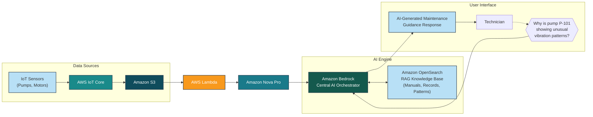

https://www.meta.ai/prompt/9ba0a9c6-c07e-4bae-8c9e-3ae78951632c

---

## 1. Foundation Model - Core Concepts

A **foundation model** is a class of large-scale **ML models** trained on a **broad spectrum of generalized and unlabeled data** using self-supervised learning, and capable of performing a **wide variety of general tasks such as understanding language, generating text and images, and conversing in natural language**.

Think of it as a reusable base. Instead of building and training a narrow, task-specific model from scratch, you start with a foundation model and adapt it for your specific use case through techniques like prompt engineering, Retrieval-Augmented Generation [RAG], and fine-tuning on Amazon Bedrock.

**Key characteristics we look for:**
1.  **Trained on generalized and unlabeled data:** Not labeled for one task, but on internet-scale diverse datasets.
2.  **Large-scale parameters:** Typically billions of parameters, enabling emergent capabilities.
3.  **Generalization:** One model can handle many general tasks via transfer learning, zero-shot and few-shot inference.

### Technical Example

Let's take a model available in **Amazon Bedrock**, like `anthropic.claude-3-5-sonnet` or `amazon.titan-text-premier-v1:0`.

**How it was built:** During pre-training, the model was exposed to petabytes of generalized and unlabeled data - Common Crawl, Wikipedia, GitHub code, books, and image-text pairs. It learns by optimizing for objectives like next-token prediction, without any human labels.

**How you use one model for many tasks:**

You deploy this single foundation model behind a Bedrock API and adapt it, you don't retrain it:

*   **For understanding language:** You give it a few-shot prompt: `Classify sentiment as Positive/Negative/Neutral for this customer review: [review text]` - it performs NLU.
*   **For generating text:** You prompt: `Generate a product description from this JSON: {"product": "AWS Graviton server", "specs": ["64 vCPU", "energy efficient"]}`
*   **For conversing in natural language:** You connect it to a Knowledge Base for Amazon S3 via RAG. Now the same model can converse with your employees and answer: `What is our return policy?` by grounding its response in your private documents.

As an AWS Generative AI Solutions Architect, here is the refined version:

## Adaptability - The Core Differentiator of Foundation Models

A **unique feature of foundation models is their adaptability**. Unlike traditional ML models that are trained for one specific task, these models can **perform a wide range of disparate tasks with high accuracy based on input prompts**, including **natural language processing, question answering, image classification, code generation, visual comprehension, and speech-to-text conversion** - without retraining the underlying model weights.

This adaptability is driven by **in-context learning** - the model adapts its behavior based on the instructions and examples you provide in the prompt via zero-shot and few-shot prompting.

### Technical Example on Amazon Bedrock

Let's take a single multimodal foundation model like `anthropic.claude-3-5-sonnet` on Amazon Bedrock. The model weights remain frozen. You adapt it purely by changing the **input prompt**:

**Same Model, 3 Disparate Tasks:**

**1. For Natural Language Processing + Question Answering [Text-to-Text]:**
> Prompt: `You are a Q&A assistant. Answer based only on this context: {S3 document text}. Question: What is the EC2 instance limit?`

**2. For Code Generation [Text-to-Code]:**
> Prompt: `Generate a Python boto3 function for image classification using Amazon Rekognition. The function should take an S3 URI as input.`

**3. For Visual Comprehension + Image Classification [Image-to-Text]:**
> Prompt: `[image: architecture-diagram.png] + Perform visual comprehension on this image and classify the architecture pattern. Is it event-driven or 3-tier? Explain.`

You didn't train three separate models for NLP, coding, and vision. You used one foundation model's adaptability to switch tasks with high accuracy simply by engineering the input prompt.

---
---

As an AWS Generative AI Solutions Architect, here's a refined version of your content - simplified for clarity, but with precise technical terminology intact.

## 2. Model Types and Selection

In Amazon Bedrock, Foundation Models (FMs) are broadly classified based on their **pre-training corpus** and intended scope. Choosing the right category is your first architecture decision, as it directly impacts accuracy, cost, latency, and governance.

We have two primary categories: General-Purpose and Specialized.

### 2.1. General-Purpose Models - Optimized for Breadth

**What they are:** These are large FMs pre-trained on massive, diverse, multi-domain corpora - including web crawl, books, open-source code, multilingual data, and conversational datasets. They are designed for strong **zero-shot and few-shot generalization**.

They excel at versatile tasks without needing domain-specific retraining: text generation, summarization, Q&A, code generation, and creative writing.

**Strengths:** Versatility, strong reasoning, supports **multimodal** inputs.
**Trade-off:** May lack deep domain terminology and can have higher **hallucination** risk on niche topics.

**AWS & Industry Examples:**
*   **Amazon Nova family** on Bedrock - Nova Micro (text, low latency), Nova Lite, Nova Pro (highly capable multimodal for text + image + video)
*   Anthropic Claude 3.5 Sonnet, OpenAI GPT-4o, Meta Llama 3.1

> **Technical Example - General-Purpose in Action**
> **Use Case:** Build an e-commerce customer support assistant that handles order tracking, product FAQs, and generates product descriptions.
> 
> **Implementation on AWS:** You can directly use a general-purpose model via Amazon Bedrock without any fine-tuning.
> ```python
> import boto3
> bedrock_runtime = boto3.client('bedrock-runtime', region_name='us-east-1')
>
> prompt = "Generate a 50-word SEO-friendly product description for: 'Wireless Noise-Cancelling Headphones, 40hr battery'"
> # Using Amazon Nova Lite - Inference with few-shot prompting
> response = bedrock_runtime.converse(
>     modelId="amazon.nova-lite-v1:0",
>     messages=[{"role": "user", "content": [{"text": prompt}]}]
> )
> ```
> **Why it works:** The model already understands marketing language, product features, and SEO concepts from its broad pre-training. No domain data needed.

### 2.2. Specialized Models - Optimized for Depth

**What they are:** These models undergo **domain-adaptive pre-training** or are trained from scratch on highly curated, domain-specific datasets - e.g., PubMed for biomedical, SEC filings for finance, or legal case law. Their **tokenizer and embeddings** are often optimized for domain-specific terminology.

They deliver higher precision, better compliance with domain ontologies, and lower hallucination in their target domain.

**Strengths:** High accuracy in niche tasks, understands domain-specific entities and relationships.
**Trade-off:** Poor generalization outside its domain. Often requires hosting via **Amazon SageMaker JumpStart**.

**Examples:**
*   **BioGPT:** Pre-trained on 15M PubMed articles for biomedical relation extraction
*   **LEGAL-BERT:** Pre-trained on legal contracts, case law for clause classification
*   **CodeT5 / Amazon CodeGuru models:** Pre-trained on code repositories for code-specific tasks

> **Technical Example - Specialized Wins Where General Fails**
> **Use Case:** Classify a clause in a legal contract as `Indemnification` vs `Limitation of Liability`.
>
> **With General-Purpose Model:** If you prompt Claude or Llama, it may confuse the two because both contain similar legal language. You would need heavy prompt engineering and few-shot examples.
> `Prompt: "Is this clause indemnification? '...the Party shall hold harmless...'" -> Model might return: "This looks like a liability clause..."`
>
> **With Specialized Model:** LEGAL-BERT is already fine-tuned for **text classification** on legal corpora. It understands legal entities out-of-the-box.
> ```python
> from transformers import pipeline
> # Model from SageMaker JumpStart
> classifier = pipeline("text-classification", model="nlpaueb/legal-bert-base-uncased")
> result = classifier("The Vendor shall indemnify and hold harmless the Client against all claims...")
> # Output: {'label': 'Indemnification', 'score': 0.98}
> ```
> **Why it works:** Its vocabulary and attention weights are already biased towards legal language, giving you 95%+ accuracy vs 70-75% with a general model.


### 2.3 Solution Architect's Decision Framework - How to Select?

Ask these 5 questions before you choose:

**1. What is the task complexity?** If task needs general reasoning -> Start with Amazon Nova / Claude on Bedrock. If it needs domain ontology (ICD-10 codes, legal citations) -> Look for specialized.

**2. What is your accuracy tolerance?** For regulated domains like Healthcare/Finance where 90%+ precision is mandatory, a general model even with RAG may not be enough. You need a specialized model.

**3. Data Availability:** Do you have 1000+ labeled domain examples? If yes, you can take a general-purpose model and create your own specialized version via **Fine-tuning or Continued Pre-training on Bedrock**.

**4. Cost and Latency:** General-purpose large models have higher inference cost and latency. A small specialized model like LEGAL-BERT (110M params) will be 10x cheaper and faster than a 70B general model for that one task.

**5. Evolvability:** General-purpose models are updated frequently by providers. Specialized models require you to maintain them.

In short: Use General-Purpose for breadth and agility, use Specialized for depth and precision.

---
---

## 3. Integration and Deployment Approaches

Choosing how to integrate a Foundation Model (FM) is an architecture trade-off between Control vs. Operational Overhead. AWS gives you 3 primary paths on this spectrum. The right choice depends on how much customization, data privacy, and ML expertise you need.

As an AWS Generative AI Solutions Architect, here is the refined version of this module. Think of this as choosing your **infrastructure ownership model** - from fully managed to fully custom.

### 3.1 Integration Approaches for Foundation Models on AWS

#### 3.1.1 Amazon Bedrock Integration - The Unified API [Recommended Starting Point]

**What it is:** A fully managed, serverless service that gives you a single **Converse API** to access 30+ FMs from Amazon Nova, Anthropic Claude, Meta Llama, Mistral, Cohere, etc. You don't manage any GPU, endpoint, or patching.

**How it works:** You call `bedrock-runtime.converse()` and pay per token - **On-Demand pricing**. For production SLAs, you can switch to **Provisioned Throughput** or **Cross-Region Inference Profiles**.

**Benefits:** Fastest time-to-market, built-in security with IAM, VPC PrivateLink, KMS encryption, plus native features like **Knowledge Bases for RAG, Agents, and Guardrails**.

**Best For:** 80% of use cases - Rapid prototyping, chatbots, summarization, RAG apps where you want to focus on application logic, not infrastructure.

> **Technical Example:**
> **Use Case:** Build a customer support chatbot that can switch models without code changes.
> ```python
> import boto3
> client = boto3.client('bedrock-runtime', region_name='ap-south-1')
>
> def ask_model(prompt, model_id):
>     # Same API for any provider
>     return client.converse(
>         modelId=model_id, # e.g., "anthropic.claude-3-5-sonnet-20240620-v1:0" or "amazon.nova-pro-v1:0"
>         messages=[{"role": "user", "content": [{"text": prompt}]}]
>     )
>
> # Day 1: Prototype with Nova Lite
> ask_model("Summarize this ticket", "amazon.nova-lite-v1:0")
> # Day 2: Switch to Claude for better reasoning - no infra change
> ask_model("Summarize this ticket", "anthropic.claude-3-5-sonnet-20240620-v1:0")
> ```
> **Why it matters:** No endpoint to deploy. You get automatic scaling to thousands of TPS.

#### 3.1.2 AWS AI Factories Integration - Managed AI On-Premises

**What it is:** This is AWS-managed AI infrastructure deployed *inside your own data center*. Think of it as Outposts, but purpose-built for Generative AI workloads. AWS builds, delivers, and operates the racks with EC2 P5 instances, networking, and observability. You get cloud-like experience on-prem.

**How it works:** You get Bedrock-like APIs locally. Your data, prompts, and **inference never leaves your premises**.

**Benefits:** Solves **data residency and sovereignty**, ultra-low latency by keeping inference close to your data sources, and meets strict compliance like PCI, HIPAA on-prem.

**Best For:** Regulated industries - Banks, Healthcare, Government in India with RBI / IRDAI requirements that data cannot cross the border.

> **Technical Example:**
> **Use Case:** A bank in Gurugram wants to build a fraud detection assistant on customer transaction data that by policy cannot leave its data center.
>
> **Architecture:** Core banking DB -> AI Factory Rack in bank's DC -> Bedrock-compatible API endpoint on-prem -> Internal App
>
> The application code remains same as Bedrock, but the endpoint URL points to the on-prem AI Factory. You get `inference latency < 50ms` because you avoid internet round-trip, and auditors are happy because PII stays within the security perimeter. AWS still handles hardware replacement and firmware patching.

#### 3.1.3 Amazon SageMaker AI Integration - Self-Host with Full Control

**What it is:** You bring and host the model yourself. You have full control over **instance type (ml.g5 / ml.p5), auto-scaling policy, container image (vLLM, TGI), and model weights**.

**How it works:** You pay for the underlying compute and storage, not per token. Ideal when you need to perform **custom fine-tuning with PEFT/LoRA or full fine-tuning** on your proprietary dataset.

**Benefits:** Complete control, ability to host custom / open-source models not on Bedrock, integrate with existing SageMaker ML pipelines.

**Best For:** Teams with ML expertise needing deep customization, specialized models, or cost optimization at very high volume.

> **Technical Example:**
> **Use Case:** Fine-tune Llama 3 8B on your company's internal financial reports so it learns your internal acronyms.
>
> ```python
> from sagemaker.jumpstart.model import JumpStartModel
> # 1. Deploy base model
> model = JumpStartModel(model_id="meta-textgeneration-llama-3-8b")
> predictor = model.deploy(instance_type="ml.g5.2xlarge")
>
> # 2. Fine-tune job with your S3 data using LoRA
> # Trainer only updates 1% of parameters, saving 90% cost vs full fine-tuning
> # 3. Deploy fine-tuned model as new endpoint
> ```
> You own the model artifact in S3. You can enable **VPC-only mode + KMS** for maximum compliance.

#### 3.1.4. Direct Provider API Integration - Direct to Anthropic / OpenAI

**What it is:** You bypass AWS and call the model provider's native API directly, often using frameworks like **LangChain or LlamaIndex**.

**How it works:** You manage your own API keys, billing with the provider, and rate limits.

**Benefits:** Day-zero access to provider's latest features - e.g., Anthropic's Prompt Caching Beta, OpenAI's Assistants API - before they land on Bedrock.

**Risks:** You lose AWS-native security (no IAM roles, no PrivateLink, no CloudTrail audit), data governance - your prompts go to the provider's cloud, and you manage vendor lock-in.

**Best For:** Only when you need a beta feature not yet in Bedrock or have an existing enterprise contract.

> **Technical Example:**
> ```python
> import anthropic
> # Direct call - key managed by you
> client = anthropic.Anthropic(api_key="sk-ant-...")
> response = client.messages.create(
>     model="claude-3-5-sonnet-20241022",
>     system="You are a coder",
>     messages=[{"role": "user", "content": "Explain prompt caching"}],
>     # This beta feature might not be in Bedrock yet
> )
> ```
> **Architect Note:** I only recommend this for experimentation. For production on AWS, route it through Bedrock for security and unified observability.

**Final Recommendation:** Start with **Bedrock**. Prove business value in days. If you hit data residency constraints, evaluate **AI Factories**. If you hit model customization limits, move to **SageMaker AI**.

---

### 3.2 Model Customization Approaches

#### 3.2.1. Prompt Engineering - Change the Input, Not the Model [Zero Cost, Start Here]

**What it is:** The art of optimizing your input prompt to get better outputs without touching the model's **parameters / weights**. This is pure application-layer optimization.

It includes 3 techniques:
* **Zero-shot:** Clear instructions
* **Few-shot:** Giving 2-3 examples in the prompt
* **Chain-of-Thought (CoT):** Asking model to "think step-by-step"

**Pros:** No training data needed, no training cost, instant iteration. Works with **On-Demand** Bedrock.
**Cons:** Limited by model's base knowledge. Doesn't teach new domain terms.

**Best For:** 70% of improvements can be achieved here. Always try this before any training.

> **Technical Example:**
> Same task, different prompt quality. Task: Classify customer feedback.
>
> **Poor Prompt (Zero-shot vague):**
> `Classify this: "The premium charge is too high"`
>
> **Optimized Prompt (Few-shot + Instruction + XML tags):**
> ```
> You are a financial sentiment classifier. Classify into [POSITIVE][NEGATIVE][NEUTRAL].
> Think step-by-step inside <thinking> tags.
>
> Examples:
> <example>Input: "Claim settled quickly" -> Output: POSITIVE</example>
> <example>Input: "Policy renewal is confusing" -> Output: NEGATIVE</example>
>
> Now classify: <input>The premium charge is too high for this coverage</input>
> ```
> Output becomes consistent JSON: `{"sentiment": "NEGATIVE", "reason": "price complaint"}`
> In Bedrock you can manage these prompts centrally with **Bedrock Prompt Management**.

#### 3.2.2. Continued Pre-Training (CPT) - Teach the Model Your Language

**What it is:** You continue to pre-train a Foundation Model like Amazon Nova on your **unlabeled domain corpus**. You are not teaching it a task, you are teaching it your *vocabulary*.

Foundation models are trained on public internet data. They don't know your internal acronyms like "ZETA = Zero Emission Truck Alliance" or your proprietary product codes. CPT injects that knowledge into the model's weights.

**How it works on AWS:** In Bedrock, you provide an S3 bucket with your domain documents. Bedrock runs **Continued Pre-Training**. It requires a lot of unlabeled data [10B+ tokens is ideal] but **no labeled data**.[PDFs][wikis][manuals]

**Best For:** When general models fail to understand domain terminology, and you have large amounts of internal, unlabeled data.

> **Technical Example:**
> **Use Case:** A healthcare company finds Nova doesn't understand ICD-10 codes and clinical notes.
>
> **Solution:**
> 1. Upload 100GB of de-identified clinical notes, medical journals to S3: `s3://my-bucket/cpt-corpus/`
> 2. Create a CPT job in Bedrock: Base Model = `Amazon Nova Micro`, S3 Data = `cpt-corpus`
> 3. The model now understands that "MI" in your notes means "Myocardial Infarction", not "Michigan".
>
> **Result:** After CPT, when you later fine-tune it for a summarization task, you need 50% less labeled data and get 20-30% higher accuracy. This is why we call CPT a **knowledge infusion layer**.

#### 3.2.3. Fine-Tuning - Teach the Model Your Task

**What it is:** You adjust model weights using your **labeled training and validation dataset** to make it excel at one specific downstream task. On AWS we use **Parameter-Efficient Fine-Tuning (PEFT) like LoRA** - we only train <1% of parameters, so it's fast and cheap.

The fine-tuned model is private to your account and requires **Provisioned Throughput** for deployment.

**Best For:** When prompt engineering + RAG still doesn't meet your accuracy SLA for a specialized task.

> **Technical Example:**
> **Use Case:** Classify support tickets into 15 custom categories with your company's definition.
>
> **Dataset Format for Bedrock Fine-Tuning (JSONL):**
> ```json
> {"prompt": "Ticket: My Nova endpoint is throttling", "completion": "Category: Bedrock_Throttling_Issue"}
> {"prompt": "Ticket: How to increase quota", "completion": "Category: Service_Quota_Request"}
> ```
> **Implementation in Bedrock Console:**
> 1. Upload `train.jsonl` [80%] and `validation.jsonl` [20%] to S3
> 2. Create Fine-tuning job -> Base Model: `Nova Lite` -> Task: Classification
> 3. Bedrock outputs a **Custom Model ARN**: `arn:aws:bedrock:us-east-1:xxx:custom-model/nova-lite-finance-v1`
> 4. Purchase Provisioned Throughput for that custom model to get inference endpoint.
>
> **Before Fine-tuning Accuracy:** 68%
> **After Fine-tuning Accuracy:** 92% - Because model has learned YOUR taxonomy.

#### 3.2.4. Nova Forge - Build Your Own Frontier Model From Scratch

**What it is:** This is not customization, this is creation. Nova Forge gives you Amazon's own training infrastructure and **Nova technology stack** to pre-train a Large Language Model from scratch on your data.

It supports training models **up to 1 Trillion parameters** with distributed training, checkpointing, and safety alignment built-in.

**Best For:** Sovereign AI, highly regulated organizations, or tech leaders who need a fully proprietary frontier model that is NOT based on any public FM, for competitive differentiation.

> **Technical Example:**
> **Use Case:** A large enterprise in India wants to build a Sovereign Indian Languages Foundation Model that understands 22 Indian languages with deep cultural context, not just translation.
>
> Existing models are English-centric. Even with CPT, they won't be enough.
>
> **With Nova Forge:**
> You bring 5 Trillion tokens of curated multilingual data. AWS provides the distributed training cluster with thousands of Trainium2 chips, data de-duplication pipeline, tokenizer training, and alignment tools. You end up with YOUR model `Bharat-1T` that you fully own - weights, IP, and deployment flexibility. You can then offer it via Bedrock as a private model.


**My Rule:** Always follow this order: **Prompt Engineering -> RAG -> CPT + Fine-Tuning -> Nova Forge.**

Don't jump to fine-tuning if a better prompt with Bedrock Knowledge Bases can solve it.

---

### 3.3 Retrieval-Augmented Generation (RAG)

#### 3.3.1.a The Problem: Why FMs Alone Are Not Enough

Foundation Models have two critical limitations in production:

1. **Knowledge Cutoff:** Their training data ends on a specific date. They don't know what happened yesterday.
2. **No Private Knowledge:** They have no access to your proprietary data - your SOPs, HR policies, product price lists, or customer tickets.

When you ask a question outside its training data, the model tries to be helpful and **hallucinates** - it generates a plausible but factually incorrect answer.

#### 3.3.1.b The Solution: Grounding the Model with Your Data

RAG solves this by connecting the FM to your external knowledge sources at **inference time**. Instead of answering from memory, the model first retrieves relevant facts and then generates an answer *grounded* in those facts.

Think of it as an **Open-Book Exam vs. Closed-Book Exam**. Without RAG is closed-book. With RAG is open-book with citations.

### 3.3.1.c The 5 Core Components of a RAG System

A production RAG system has two flows: Ingestion Flow and Retrieval Flow.

**1. Document Processing**
Raw documents are not fed directly to a vector DB. They are pre-processed.
**Technical Terms:** **Chunking, Overlap, Metadata Extraction.**
You split large PDFs into smaller chunks of 300-500 tokens with 10-20% overlap to maintain context. A 100-page HR policy doc becomes 200 chunks.[Ingestion]

> *Best Practice:* Don't chunk blindly. Use semantic chunking - keep a paragraph or a section together. Add metadata like `source: hr_policy.pdf, year: 2024`.

**2. Embedding Models**
Converts human text chunks into **mathematical vectors / embeddings** - a list of 1024 or 1536 floating-point numbers that capture semantic meaning.[Ingestion]

**Technical Terms:** **Amazon Titan Embeddings G1 - Text, Cohere Embed v3.** Text with similar meaning will have vectors close to each other in vector space, measured by **cosine similarity**.

`Text: "What is remote work policy?" -> Vector: [0.02, -0.13, 0.88,...1024]`

**3. Vector Storage [Ingestion + Retrieval]**
A specialized database optimized for **Approximate Nearest Neighbor (ANN) search** of vectors at millisecond latency.

**AWS Options:** **Amazon OpenSearch Serverless (vector engine), Amazon Aurora PostgreSQL with pgvector, Amazon OpenSearch Service.**

**4. Query Processing**
When user asks a question, we don't do keyword matching. We do semantic search.[Retrieval]

**Flow:** User Query -> Convert Query to Embedding using same embedding model -> Search Vector DB for top-k chunks with highest cosine similarity -> Optional **Re-ranking and Hybrid Search (keyword + semantic) + Metadata Filtering**.

**5. Response Generation**
We use **Prompt Augmentation**. We inject the retrieved chunks as context into the final prompt sent to the LLM.[Retrieval]

> Prompt = `System: Answer only from context. Cite sources. <context>{retrieved chunks}</context> Question: {user query}`

This forces the FM to ground its answer and provide **source attribution**, reducing hallucination by 70-80%.

### 3.3.1.d AWS Implementation - Two Paths

**Path A: Fully Managed - Amazon Bedrock Knowledge Bases**[Recommended]

Zero code. You point to S3, select embedding model and vector store. AWS manages the entire ingestion pipeline - chunking, embedding, indexing, and retrieval.

Fully supports **OpenSearch Serverless, OpenSearch Service, Aurora PostgreSQL, Pinecone**.

Ideal for teams who want to go live in hours and want automatic data sync when S3 documents change.

**Path B: Custom RAG Pipeline**

Build your own for full control. Architecture:

`S3 (Docs) -> Lambda (Chunking with LangChain) -> Bedrock Titan Embeddings API -> OpenSearch Serverless -> Lambda (Retriever) -> Bedrock Nova Pro (Generator) -> API Gateway`

You control chunking strategy, hybrid search logic, and re-ranking model.

> **Technical Example: End-to-End Custom RAG in Code**
> **Use Case:** Employee asks: "What is our parental leave policy for 2024?"
>
> **Without RAG:** Nova says: "I don't have access to your internal policy..." or hallucinates a generic 12-week policy.
>
> **With RAG - Retrieval Flow:**
> ```python
> import boto3
> bedrock = boto3.client('bedrock-runtime')
>
> # Step 1: User query -> Embedding
> query = "What is our parental leave policy for 2024?"
> emb_response = bedrock.invoke_model(
> modelId="amazon.titan-embed-text-v2:0",
> body='{"inputText": "%s"}' % query
> )
> query_vector = emb_response['embedding']
>
> # Step 2: Vector Search in OpenSearch Serverless - finds top 3 chunks
> # retrieved_chunks = ["As per HR Policy 2024 doc page 12, parental leave is 26 weeks...",...]
>
> # Step 3: Augmented Generation with Citations
> final_prompt = f"""
> Use only the following context to answer. Cite source as.
> <context>{retrieved_chunks}</context>
> Question: {query}
> """
>
> response = bedrock.converse(
> modelId="amazon.nova-pro-v1:0",
> messages=[{"role": "user", "content": [{"text": final_prompt}]}]
> )
> # Output: "As per HR Policy 2024, parental leave is 26 weeks [hr_policy_2024.pdf, page 12]."
> ```[source]

### 3.3.1.e When to Use RAG?

Use RAG when your application needs:

1. **Current Information:** Beyond model cutoff - e.g., "What was yesterday's sales?"
2. **Private Domain Knowledge:** Your SOPs, contracts, product catalogs.
3. **Hallucination Reduction & Compliance:** In regulated domains, you need to show *where* the answer came from. RAG provides traceable source attribution.
4. **Lower Cost than Fine-tuning:** You can update your knowledge base by just uploading a new file to S3, no retraining needed.

**Architect's Rule of Thumb:** If the answer changes more than once a month or needs a citation, use RAG. If the model needs to learn a new *skill or style*, use Fine-Tuning. In production, best systems use **RAG + Fine-Tuning together**.

---
---

## 3.4 Model Chaining and Orchestration

**The Core Idea:** Complex applications are not one prompt. They are a **Directed Acyclic Graph (DAG)** of multiple steps. Model chaining is connecting the output of one model as the input to the next. Orchestration is the control plane that manages that workflow - its state, branching logic, error handling, and observability.

Think of it like microservices, but for AI models.

A single call to Amazon Nova cannot: read a loan application PDF, check the applicant's credit history, decide risk, and send a personalized approval email. You need chaining.


### 3.4.1 Model Chaining

**What it is:** Model chaining is building a **predefined, fixed DAG [Directed Acyclic Graph]** workflow where you, the architect, design the path in advance. The output of one step becomes the input of the next. It is predictable, debuggable, and ideal for workflows where compliance and repeatability matter.

Think `Prompt A → Prompt B → Service C → Output`. No LLM decides the flow at runtime. You do.

This is different from Agentic Orchestration where the LLM decides the next step dynamically. Chaining is deterministic.

We use 4 core chaining patterns on AWS:

#### 1. Sequential Chaining - The Assembly Line

**Concept:** Linear flow. `Model 1 output` is the input to `Model 2`. Used for multi-stage transformation where each step refines the previous.

**Technical Terms:** Prompt chaining, state passing.

> **Technical Example:**
> **Use Case:** E-commerce - Convert a raw supplier spec sheet into a final product listing.
> **Chain:** `Raw PDF Text -> Nova Lite [Extract Attributes as JSON] -> Nova Pro [Generate Marketing Description from JSON] -> Titan Image [Generate Product Image from Description]`
> If Step 1 fails to extract JSON, the chain stops. Easy to debug. Implemented in **Amazon Bedrock Flows** by connecting 3 Prompt nodes in series.

#### 2. Parallel Processing - Fan-Out / Fan-In

**Concept:** Same input is sent to multiple models/services **concurrently** to reduce latency, then results are aggregated. This is for enrichment.

**Technical Terms:** Parallel inference, aggregation / reduction step.

> **Technical Example:**
> **Use Case:** A single customer support ticket comes in.
> **Fan-Out:** The ticket text is sent in parallel to 3 lightweight models:
> * Branch A: `Nova Micro` for Sentiment Analysis -> `NEGATIVE`
> * Branch B: `Amazon Comprehend` for PII Detection -> `Contains Phone Number - Redact`
> * Branch C: `Titan Embeddings` for Topic Classification -> `Billing`
> **Fan-In:** A Lambda function aggregates: `{"sentiment": "NEGATIVE", "pii": true, "topic": "Billing"}` and routes to priority queue. Total latency = max of 3 branches, not sum.

#### 3. Conditional Branching - The Intelligent Router

**Concept:** Use a classifier model as a switch to choose different downstream paths based on input characteristics. This saves cost and improves accuracy.

**Technical Terms:** Router pattern, intent classification.

> **Technical Example:**
> **Use Case:** Customer chatbot with 2 specialized knowledge bases.
> **Chain:**
> ```python
> # Step 1: Router - cheap & fast model
> intent = bedrock.converse(modelId="amazon.nova-micro-v1:0", 
>   prompt="Classify intent as BILLING or TECHNICAL: {user_query}")
>
> # Step 2: Conditional Branch - AWS Step Functions Choice State
> if intent == "BILLING":
>   response = bedrock.retrieve_and_generate(KB_ID="billing-kb", query=user_query)
> else:
>   response = bedrock.retrieve_and_generate(KB_ID="tech-kb", query=user_query)
> ```
> You don't waste expensive RAG calls to both KBs. In Step Functions, this is a `Choice State`.

#### 4. Feedback Loops - Evaluator-Optimizer

**Concept:** Output of a model is fed back to evaluate and improve itself. The workflow loops until a quality threshold is met.

**Technical Terms:** Self-reflection, evaluation loop, max iterations.

> **Technical Example:**
> **Use Case:** Generate high-quality SQL from natural language. First-draft SQL is often wrong.
> **Chain:**
> 1.  **Generator:** `Nova Pro` generates SQL: `SELECT * FROM orders`
> 2.  **Evaluator:** `Nova Micro` as a critic + `Lambda` that executes `EXPLAIN` on Amazon Athena to check syntax. Output: `FAIL - Missing filter for 2024`
> 3.  **Feedback Loop:** The error + original SQL is fed back to Generator: "Fix this SQL based on this error...". Loop until `PASS` or max 3 retries.
>
> In **Bedrock Flows**, you implement this with a Loop Node with condition `quality_score < 0.9`.

---

### 3.4.2 AWS orchestration services

### AWS Step Functions - For Reliable, Multi-Step Workflows

This is our visual workflow orchestrator. You define your entire AI workflow as a state machine - a series of steps with built-in state management. Step Functions handles the hard parts for you: it keeps track of where you are in the workflow, automatically retries if a Bedrock call throttles, handles errors with catch logic, and gives you full monitoring in CloudWatch.

It has direct, optimized integrations with over 200 AWS services like Amazon Bedrock, Amazon Textract, Amazon Comprehend, and Lambda, so you don't write glue code to call them.

We use it when the workflow is complex, long-running, needs human approval, or must be auditable for compliance.

#### AWS Lambda - For Lightweight, Event-Driven Connections

This is our serverless compute. It is event-driven and runs only when triggered, so you pay only for the milliseconds it runs. We use Lambda as the glue between AI services - to transform data between model calls, to run custom Python logic, to call the Bedrock Converse API, or to trigger the next step.

We use it for intermittent workloads and for the small tasks inside a larger workflow.

In practice, we almost always use them together. Lambda does the work inside each step, Step Functions orchestrates the order of those steps.

> **Technical Example: Customer Feedback Analysis Pipeline**

> **Use Case:** Customer uploads a feedback PDF to S3. We need to extract text, analyze sentiment, and if it's negative, generate a detailed root-cause analysis.

> **Architecture:**
> S3 Upload -> Triggers Lambda -> Starts Step Functions State Machine[Starter]

> **Step Functions State Machine does this:**
> 1. Calls Amazon Textract to extract text from PDF
> 2. Calls two tasks in Parallel: Amazon Comprehend for sentiment AND Bedrock Titan Embeddings to store it in vector DB
> 3. Choice State: If sentiment is NEGATIVE, go to next step, else end
> 4. Calls Amazon Bedrock Nova Pro to generate a root-cause summary and sends it to an SNS topic for the support team
> 5. Stores final result in DynamoDB

> **Why this combination is powerful:**
> If the Bedrock call in step 4 fails due to throttling, Step Functions automatically retries it with exponential backoff. You don't lose the state. The Lambda function that calls Bedrock is simple and stateless:
> ```python
> import boto3
> bedrock = boto3.client('bedrock-runtime')
> def lambda_handler(event, context):
> text = event['extracted_text'] # comes from Step Functions state
> response = bedrock.converse(
> modelId="amazon.nova-pro-v1:0",
> messages=[{"role": "user", "content": [{"text": f"Summarize root cause: {text}"}]}]
> )
> return {"summary": response['output']['message']['content']['text']}
> ```
> Lambda handles the Bedrock API call, Step Functions handles the reliable coordination, retries, and overall flow. For a simple 2-step chain, Lambda alone is enough. For anything with 3+ steps, branching, or parallel processing, use Step Functions to orchestrate Lambdas.[0]

---

### 3.4.3 Implementation examples

#### 1. Event-Driven Orchestration with Amazon EventBridge**

When you have many AI services that need to react to each other without being tightly connected, we use EventBridge as the central event bus. It enables loose coupling and asynchronous processing. One service publishes an event, and multiple other services react to it independently.

*Example:* A new video is uploaded to S3. S3 publishes an event `VideoUploaded` to EventBridge. EventBridge has rules that trigger three independent model chains in parallel - one chain calls Amazon Transcribe to generate subtitles, one calls Amazon Rekognition to detect unsafe content, and one calls Bedrock Nova to generate a summary. If you add a fourth chain later for translation, you just add a new rule, you don't change the uploader. This is how you scale AI workflows without creating dependencies.

#### 2. Document Processing Pipeline

This is a classic sequential chain where each step is optimized for a specific task.

*Example - Insurance Claims Processing:*
A claim form PDF lands in S3. The Step Functions workflow starts:
First, Amazon Textract does OCR to extract text and tables with high accuracy. Then, a fast model like Nova Micro classifies the document as `Medical Claim` or `Vehicle Claim`. Based on that classification, Nova Pro summarizes the key details into structured JSON. Finally, the JSON and summary are stored in DynamoDB and the vector embedding is stored in OpenSearch Serverless for future RAG search. Each step uses the best model for that job.

#### 3. Multi-Modal Content Generation

This chain flows across modalities - text to image to text - using different foundation models for different modalities.

*Example - E-commerce Product Launch:*
You start with a text prompt: `Premium leather backpack for travel`. Step 1 calls Amazon Titan Image Generator v2 to generate product images. Step 2 takes that generated image and passes it to Nova Pro with vision capability for image analysis - it checks if the image meets brand guidelines like background color. Step 3, if approved, Nova Pro generates SEO-friendly captions, titles, and social media descriptions from the same image. You move from text -> image -> text using purpose-built models.

#### 4. Intelligent Customer Service with Adaptive Routing

This is a router pattern that adapts based on complexity and sentiment.

*Example - Support Bot:*
User asks: `My order is late and I'm very frustrated`.
First, Nova Micro does intent classification to detect it is a `Shipping Issue`. Second, it calls a Bedrock Knowledge Base built on Aurora PostgreSQL to retrieve the shipping policy and order status. Third, Nova Pro generates a personalized empathetic response using that retrieved context. Fourth, in parallel, Comprehend does sentiment analysis. Step Functions uses a Choice State - if sentiment is still highly negative after the response, it adaptively routes the conversation to a human agent via Amazon Connect and provides the agent with a full summary generated by the chain.

---

### 3.4.4 Agentic AI

Agentic AI as the shift from a **fixed assembly line to a self-directing team**.

Model chaining is deterministic - you design the path. Agentic AI is autonomous - you give it a goal, and the agent itself decides the path in real-time.

An agent is not just a foundation model calling an API. It is a system with four capabilities:

**1. Reasoning and Planning:** Using techniques like **ReAct [Reason + Act]**, the LLM breaks a complex, open-ended goal into smaller steps. It doesn't just answer, it thinks "what should I do next?"

**2. Tool Use:** The agent is given tools to act on the world. On AWS, we call these **Action Groups** - Lambda functions like `search_company_wiki`, `query_database`, `execute_code`, or `call_external_api`. The agent chooses which tool to use and with what parameters.

**3. Memory:** It maintains short-term memory of the current conversation and long-term memory via **Bedrock Knowledge Bases** to retain context across steps.

**4. Adaptation:** If a tool fails or returns unexpected data, it re-plans its approach dynamically, with less human oversight.

We build this on AWS with **Amazon Bedrock Agents**, where you define the agent's instruction, give it Knowledge Bases, Action Groups, and Guardrails, and it handles the orchestration loop for you.

> **Technical Example: Autonomous DevOps Incident Responder**
>
> **Goal given by human:** "The payment service in prod has a high error rate, fix it."
>
> **This is not a fixed chain, because we don't know the root cause in advance. Here is how the agent thinks and acts:**
>
> **Step 1 - Plan:** The Bedrock Agent with Claude 3.5 Sonnet reasons: "To fix payment errors, I first need to find the error logs."
> **Step 2 - Act:** It autonomously chooses the tool `searchCloudWatchLogs` Action Group -> finds `Database connection timeout in us-east-1`.
>
> **Step 3 - Re-Plan:** Based on that output, it reasons: "Connection timeout. I need to check the runbook for this error."
> **Step 4 - Act:** It chooses `searchKnowledgeBase` tool -> retrieves runbook from Bedrock Knowledge Base: "If DB timeout, check Aurora metrics and restart connection pool."
>
> **Step 5 - Act:** It chooses `executeLambda` tool to call `restartConnectionPool` and `queryAuroraMetrics`.
>
> **Step 6 - Final:** It verifies error rate dropped in CloudWatch and generates a summary: "Root cause was exhausted DB connections. Restarted pool at 14:32 UTC. Error rate back to normal. Full trace in ticket INC123."
>
> You never hardcoded "if timeout then restart". The agent planned, selected tools, executed, and adapted on its own to achieve the goal. This is what we use for open-ended problems like research, troubleshooting, and multi-system automation where the path cannot be predefined.

---
---

### 3.5. Real-World Implementation: Predictive Maintenance with Generative AI



**The Business Problem:** A factory wants to predict equipment failure before it happens and let technicians ask questions in natural language like they would ask a senior engineer, while keeping all sensor and maintenance data inside their company boundary for compliance.

**The High-Level Architecture:** We build this as an event-driven system with Amazon Bedrock as the central AI brain.

**1. Data Ingestion Pipeline - From Shop Floor to Cloud**
IoT vibration and temperature sensors on equipment like Pump P-101 stream data via MQTT to **AWS IoT Core**. An IoT Core Rule routes this data to Amazon S3 as a data lake and simultaneously triggers an **AWS Lambda** function for real-time processing.

That Lambda does feature engineering - it converts raw time-series into RMS vibration, frequency spectrum - and calls a specialized failure detection model. This is a **fine-tuned model on SageMaker** trained on your specific pump's historical failure patterns. It is much more accurate than a general model for recognizing your equipment-specific signatures.

All processed sensor data, equipment images, and maintenance logs are then indexed into **Amazon OpenSearch Service**.

**2. The AI Brain - Multi-Modal Analysis + RAG**

This is where Amazon Bedrock orchestrates everything.

We use **Amazon Nova Pro** for its multi-modal capability. It can analyze both the time-series sensor chart and a photo of the pump taken by the technician together to understand the context.

For knowledge, we build a **Bedrock Knowledge Base on OpenSearch**. This RAG system contains three types of data:
* Equipment manuals and SOPs
* Historical maintenance records and tickets
* Normal vs. abnormal sensor pattern embeddings

When we search, we use **hybrid search** - semantic search to find relevant maintenance procedures, time-series similarity search to find past sensor patterns that looked similar, and keyword filtering on equipment ID.

**3. Technician Experience - Natural Language Troubleshooting**

The technician interacts through a simple chat app powered by Bedrock.

> **Technical Example: What happens when technician asks "Why is pump P-101 showing unusual vibration?"**

> **Step 1:** The query goes to Bedrock. Bedrock first converts the query to a vector and searches OpenSearch.

> It retrieves:
> a] From manuals: "Section 4.2 - High axial vibration indicates bearing wear"
> b] From history: "Ticket #8921 - P-101 had similar pattern 3 months ago, bearing replaced"
> c] From sensor store: "Current vibration pattern 92% similar to pre-failure pattern from Jan"

> **Step 2:** Bedrock augments the prompt:
> ```
> Context from RAG:
> - Manual: High axial vibration = bearing wear
> - History: Last time similar pattern, bearing replacement fixed it
> - Live Sensor: P-101, 8.2mm/s RMS, axial direction, 92% similarity to failure
>
> User Question: Why is pump P-101 showing unusual vibration?
> Instruction: Answer using context, provide maintenance steps, cite sources.
> ```

> **Step 3:** Nova Pro generates the final answer: "P-101 is showing 8.2mm/s axial vibration, which is above the 7mm/s threshold. Based on manual Section 4.2 and a 92% match to the failure pattern from ticket #8921, this indicates probable bearing wear. Recommended action: Schedule bearing inspection as per SOP-12. Last replacement was 3 months ago."[source]

> This whole workflow keeps data within the VPC using Bedrock VPC PrivateLink and OpenSearch in VPC, meeting compliance while combining sensor analytics with generative AI reasoning.